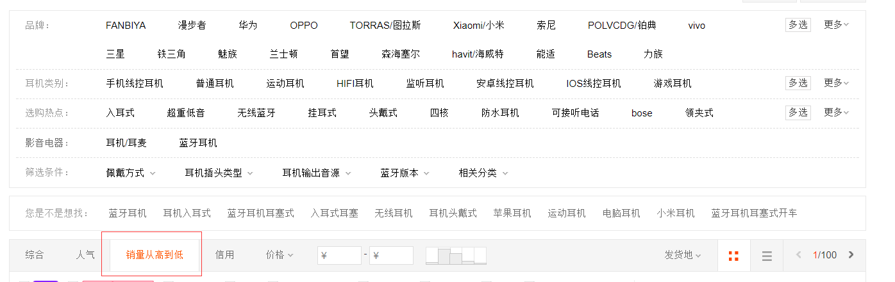
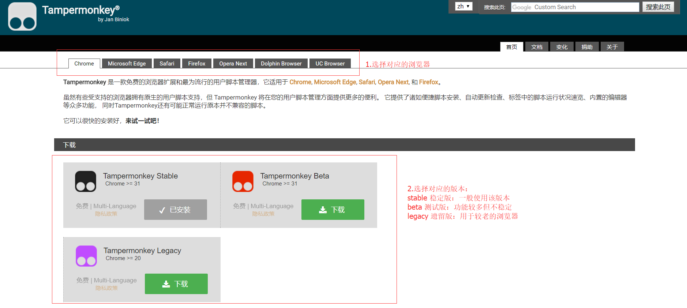
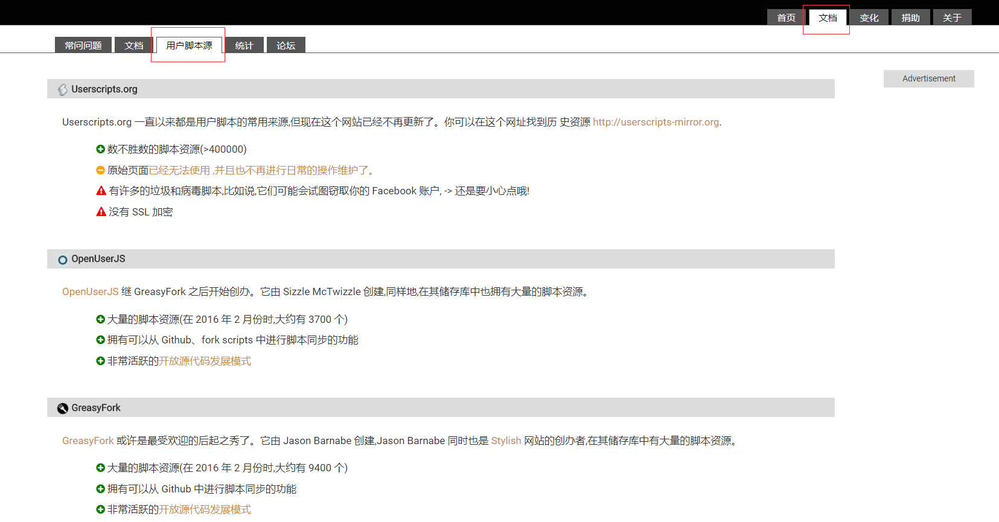

# 网页脚本的食用方式

网页脚本是指嵌入运行于浏览器上的脚本，它能够改变页面原有功能的运作模式，给页面添加或者去除功能。

比如：

- 破解vip视频会员合集

安装了该插件后在支持的视频页面就会出现如下两个按钮，点击VIP线路选择按钮后跳转到另一个视频解析页面即可查看完整视频

- 淘宝销量排序脚本

安装了该脚本后不需要做什么，在淘宝内搜索商品后自动以销量来排序商品。

## 安装脚本管理器
安装使用前需要先安装使用脚本管理器，脚本管理器可以下载安装需要使用的脚本、也可以运行自己编写的脚本。目前使用人数最多的最为流行的脚本管理器是油猴子([Tampermonkey](http://tampermonkey.net/))脚本管理器

安装完成了脚本管理器后就是找脚本安装了，在油猴子页面的文档->用户脚本源处可以看到油猴推荐的几个网站。 
[Userscripts](https://openuserjs.org/) [OpenUserJS](https://openuserjs.org/) [GreasyFork](https://greasyfork.org/)

建议使用GreasyFork，因为该网站支持的脚本相对较多，并且国际化（也就是支持中文）做的比较好，而且不需要翻墙，还没有什么安全问题。

## 脚本安利
- [淘宝天猫优惠券领取](https://greasyfork.org/zh-CN/scripts/36922-%E6%B7%98%E5%AE%9D%E5%A4%A9%E7%8C%AB%E5%86%85%E9%83%A8%E4%BC%98%E6%83%A0%E5%88%B8-%E4%B8%80%E9%94%AE%E9%A2%86%E5%8F%96-%E8%B4%AD%E7%89%A9%E5%89%8D%E9%A2%86%E4%B8%80%E4%B8%8B-%E7%9B%B4%E6%8E%A5%E7%9C%81%E9%92%B120-%E4%BB%A5%E4%B8%8A-2018-2-17%E6%9B%B4%E6%96%B0)
- [从google play直接下载app安装包](https://greasyfork.org/zh-CN/scripts/33005-direct-download-from-google-play)
- [全网音乐免费下载](https://greasyfork.org/zh-CN/scripts/37058-%E5%85%A8%E7%BD%91%E9%9F%B3%E4%B9%90%E4%B8%80%E9%94%AE%E5%85%8D%E8%B4%B9%E4%B8%8B%E8%BD%BD-%E4%B8%80%E9%94%AE%E6%90%9C%E7%B4%A2-%E5%9C%A8%E7%BA%BF%E8%AF%95%E5%90%AC-%E6%9C%80%E6%96%B0%E4%BF%AE%E5%A4%8D%E7%89%882018-1-18%E6%99%9A%E6%9B%B4%E6%96%B0)
- [youtube视频下载](https://greasyfork.org/zh-CN/scripts/19592-youtube-best-video-downloader-2)
- [淘宝销量排序](https://greasyfork.org/zh-CN/scripts/14505-%E6%B7%98%E5%AE%9D%E9%94%80%E9%87%8F%E6%8E%92%E5%BA%8F)
- [网盘自动填写密码](https://greasyfork.org/zh-CN/scripts/14505-%E6%B7%98%E5%AE%9D%E9%94%80%E9%87%8F%E6%8E%92%E5%BA%8F)
- [百度网盘直接下载助手](https://greasyfork.org/zh-CN/scripts/23635-%E7%99%BE%E5%BA%A6%E7%BD%91%E7%9B%98%E7%9B%B4%E6%8E%A5%E4%B8%8B%E8%BD%BD%E5%8A%A9%E6%89%8B)
- [破解VIP会员视频集合](https://greasyfork.org/zh-CN/scripts/27530-%E7%A0%B4%E8%A7%A3vip%E4%BC%9A%E5%91%98%E8%A7%86%E9%A2%91%E9%9B%86%E5%90%88)
- [网易云音乐高音质支持](https://greasyfork.org/zh-CN/scripts/27530-%E7%A0%B4%E8%A7%A3vip%E4%BC%9A%E5%91%98%E8%A7%86%E9%A2%91%E9%9B%86%E5%90%88)
- [腾讯动漫-破解](https://greasyfork.org/zh-CN/scripts/16887-%E8%85%BE%E8%AE%AF%E5%8A%A8%E6%BC%AB-%E7%A0%B4%E8%A7%A3)

最后安利下我写的[脚本](https://greasyfork.org/zh-CN/users/155550-yeomanye)，欢迎大家到我的[github](https://github.com/YeomanYe/web-scripts)上提出pr、issues、脚本需求，谢谢大家。交流Q群:591792275